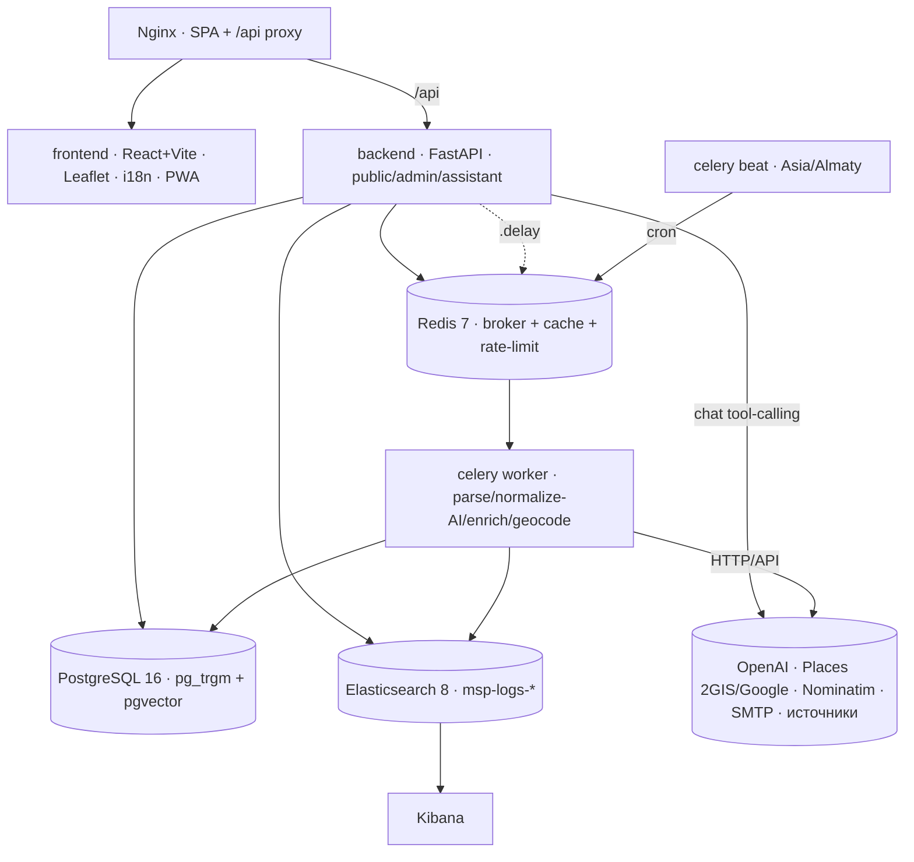
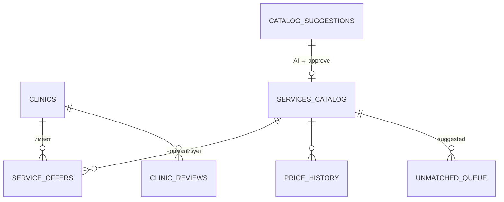

# MedServicePrice.kz — Архитектура

> Агрегатор цен на медуслуги в Казахстане. Собирает публичные прайс-листы, нормализует
> названия к единому каталогу, даёт поиск/сравнение/чек-ап цен. Принцип: **никаких мок-данных**.
>
> 📊 **Визуальные схемы:** [docs/architecture.html](docs/architecture.html) (C4, ЧБ) ·
> [docs/component-diagram.html](docs/component-diagram.html) (детальные потоки: LLM / парсинг / дедуп / логи).

Тип: **модульный монолит + event-driven ингестия** на клиент-серверной основе. 8 контейнеров.

## 1. Контейнеры (docker-compose)

## 2. Источники (≥3) — adapter-паттерн

| Источник | Тип | Города |
|---|---|---|
| **KDL Olymp** (`kdlolymp.kz`) | HTML (server-rendered) | 5 |
| **Invitro** (`invitro.kz`) | HTML (Bitrix) | 3 |
| **doq.kz** | публичный JSON API | 6 |
| **Файловый импорт** | Excel/CSV/PDF/DOCX | — |

Новый источник = подкласс `BaseParser` + строка в `registry.py`. Ядро не меняется.

## 3. Модель данных (12+ таблиц)

Также: `raw_records`, `parse_logs`, `subscriptions`, `alerts`. Двухслойность:
`raw_records` (аудит, дедуп `content_hash`) → `service_offers` (рабочий слой, дедуп
`offer_hash`). `service_id = NULL` — норма (услуга в `unmatched_queue`), цена видна.

## 4. Ингестия + дедупликация (services/ingest.py)

`fetch (robots+delay+retry)` → **content_hash** (дедуп сырья) → clinic upsert →
нормализация → **offer_hash** (дедуп оффера, insert/update) → price_history
(append-on-change) → ParseLog → **алёрты** (`failed`/0 записей) → инвалидация кэша.
Изоляция: 1 источник = 1 задача; партиал-толерантность на уровне строки/источника.

## 5. Нормализация

- **Авто:** `exact` → `fuzzy: token_set ≥ 88 И token_sort ≥ 60` (двойной порог не схлопывает панели). Остаток → `unmatched_queue`.
- **AI-нормализация:** LLM кластеризует очередь в новые позиции каталога (`catalog_suggestions`) → аналитик подтверждает → синонимы привязывают офферы → `renormalize`.

## 6. Поиск, сравнение, AI-ассистент

- **Поиск:** lexical (pg_trgm) + semantic (pgvector) + RRF-гибрид. Фильтры: город, категория, цена, срок, рейтинг, онлайн-запись. Сортировки: цена/рейтинг/свежесть/**расстояние** (геолокация).
- **Чек-ап (корзина):** дешевле всего для набора услуг в одной клинике.
- **AI-ассистент:** OpenAI за safety-gateway (injection → модерация → scope → ответ → проверка утечки) + **tool-calling** — модель вызывает `search`/`offers`/`basket` и отвечает живыми ценами (не RAG: данные структурные).
- **Обогащение:** рейтинги/отзывы/фото из 2GIS/Google Places + JSON-LD, с валидацией города (не подставляет чужой филиал).

## 7. Наблюдаемость

| Слой | Где |
|---|---|
| Структурные JSON-логи | Elasticsearch + Kibana + `/admin/logs` |
| Аудит запусков | `parse_logs` → дашборд источников |
| Алёрты (failed/0/stale) | `alerts` → баннер в админке + email |

## 8. Безопасность

slowapi rate-limit (Redis) · CORS на origin · admin за `X-API-Key` (защищена вся `/admin/*` SPA) ·
security-headers · ORM-only · `page_size ≤ 100` · Pydantic-валидация · парсер уважает robots.txt + delay ·
ассистент: rate-limit + модерация + scope-классификатор + проверка утечки промпта. Только публичные цены, без PII.

## 9. Готовность

| Готово | Частично (нужен ключ) | Инфра / план |
|--------|----------|-----|
| 3 веб-источника + файлы, пайплайн+дедуп, нормализация (+AI), поиск, фильтры, сортировки, карта, сравнение, чек-ап, история, подписки+рассылка, AI-ассистент (tool-calling), обогащение, админ-SPA, ELK, алёрты, i18n, PWA, Docker (8 сервисов) | рейтинги/отзывы (ключ 2GIS), AI-генерация каталога (ключ OpenAI) | бэкапы Postgres, метрики Prometheus, дедуп клиник между источниками, SEO-лендинги |
