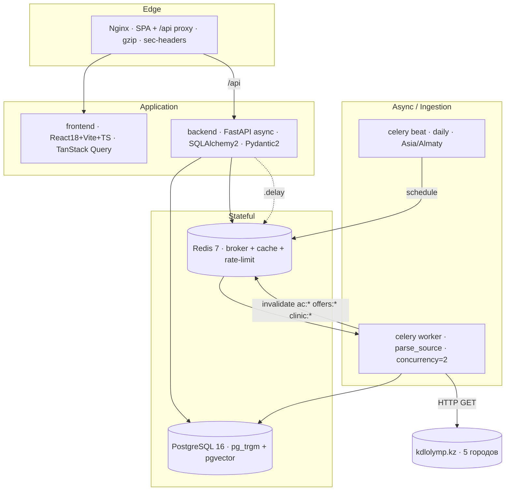
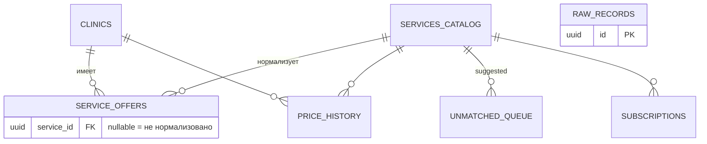

# MedServicePrice.kz — Архитектура

> Агрегатор цен на медуслуги в Казахстане. Парсит публичные прайс-листы, нормализует
> названия к единому каталогу, даёт поиск/сравнение цен. Принцип: **никаких мок-данных**.
>
> 📊 **Визуальная схема:** открой [docs/architecture.html](docs/architecture.html) в браузере.

## 1. Контейнеры (docker-compose)

## 2. Модель данных

Двухслойность: `raw_records` (аудит, дедуп `content_hash`) → `service_offers`
(рабочий слой, дедуп `offer_hash`). `service_id = NULL` — норма (услуга не привязана
к каталогу, ушла в `unmatched_queue`), цена при этом уже видна.

## 3. Поток ингестии (tasks/parsing.py)

```mermaid
flowchart LR
    A[beat daily] --> B[parse_source.delay]
    B --> C[fetch: robots+delay+retry] --> D[BeautifulSoup → RawRecord]
    D --> E[1 raw dedup content_hash] --> F[2 clinic upsert verified]
    F --> G[3 normalize 2-порога] --> H[4 offer upsert offer_hash]
    H --> I[5 price_history append-on-change] --> J[commit + ParseLog]
    J --> K[invalidate cache]
```

Изоляция: каждый город KDL = отдельная задача; партиал-толерантность на уровне строки
и источника; инвалидация кэша не валит задачу.

## 4. Поиск (services/search.py)

`lexical (pg_trgm)` всегда → при `ENABLE_SEMANTIC=true` добавляется `semantic (pgvector
HNSW cosine)` → слияние `RRF (k=60)`. Без эмбеддингов `hybrid` тихо схлопывается в lexical.

## 5. Нормализация (services/normalization.py)

`exact` → `fuzzy: token_set_ratio ≥ 88 И token_sort_ratio ≥ 60`. Двойной порог нужен,
чтобы не схлопывать панели анализов в один тест. Остаток → `unmatched_queue`, аналитик
добивает вручную (`/admin/unmatched/{id}/resolve`), опционально обучая синоним.

## 6. Безопасность

slowapi 120/min (Redis) · CORS на origin (не `*`) · admin за `X-API-Key` · security-headers
(app + Nginx) · ORM-only · `page_size ≤ 100` · Pydantic-валидация · парсер уважает
robots.txt + delay. Только публичные цены, без PII.

## 7. Готовность

| Готово | Частично | Нет |
|--------|----------|-----|
| БД+миграции, парсер KDL, пайплайн, нормализация, лексика, public+admin API, beat, фронт (9 экранов), Docker | семантика (off by default), подписки (без рассылки), FX (без источника курса) | прочие источники, user-auth, гео/карта |

## Документация

Источник истины — код и этот файл. Корневой [`../CLAUDE.md`](../CLAUDE.md)
синхронизирован с этим проектом (стек, инварианты, маршрутизация скиллов).
Визуальная схема — [docs/architecture.html](docs/architecture.html).
